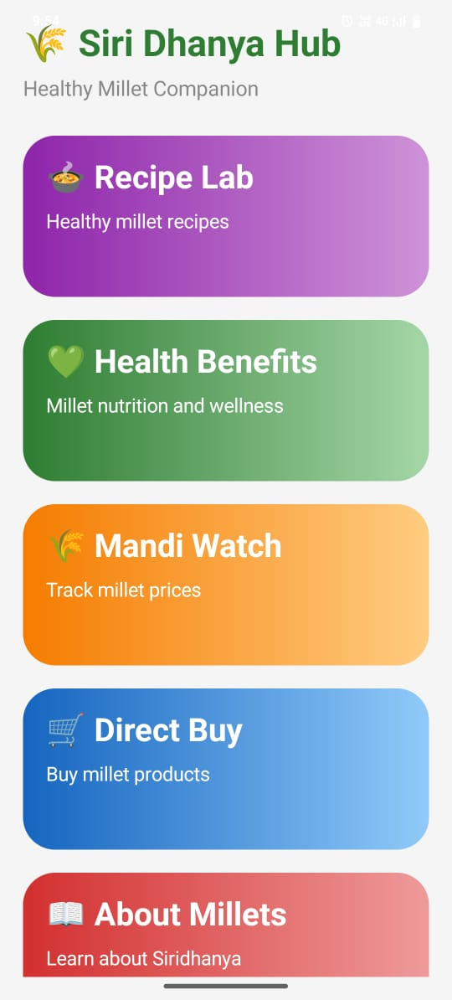
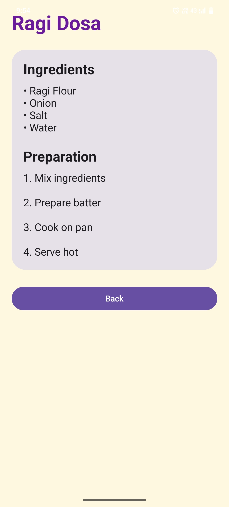
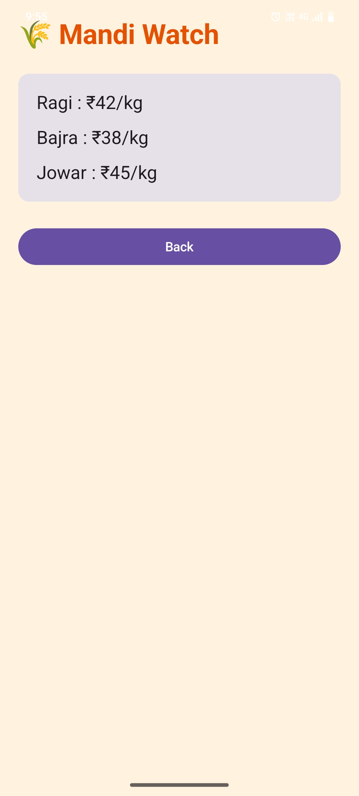
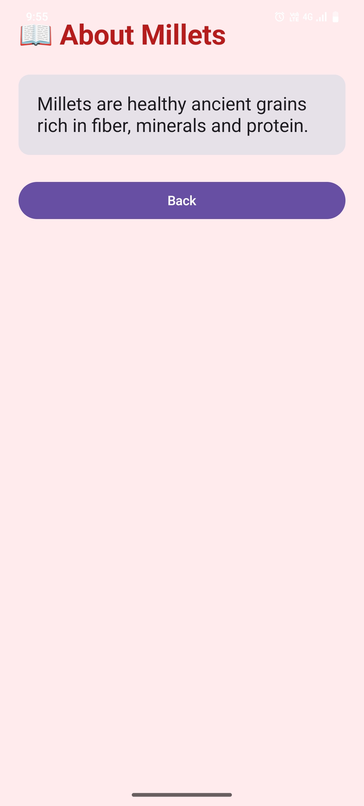

# SiriDhanyaHub

SiriDhanyaHub is an Android application developed using Kotlin and Jetpack Compose to promote healthy millet-based lifestyles.

## Features

- Healthy millet recipes
- Nutritional and health benefits
- Millet market price tracking
- Direct millet product purchase section
- Information about different millets
- Simple and user-friendly UI

## Technologies Used

- Kotlin
- Android Studio
- Jetpack Compose
- Material Design

## Screens Included

- Splash Screen
- Home Screen
- Recipe Screen
- Recipe Details Screen
- Health Benefits Screen
- Mandi Watch Screen
- Direct Buy Screen
- About Millets Screen

## Purpose of the Project

The project was developed to create awareness about the nutritional importance of millets and provide users with easy access to millet recipes, health information, and product details through a mobile application.

## Developer

Nisha Manjunath
## Application Screenshots

### Splash Screen

### Home Screen

### Recipe Screen

### Recipe Details Screen

### Health Benefits Screen

### Mandi Watch Screen

### Direct Buy Screen

### About Millets Screen

## Future Enhancements

- AI-based millet recommendations
- Real-time market price updates
- Multilingual language support
- Cloud database integration
- Online purchasing system

- ## Project Architecture

The application follows a simple modular architecture using Jetpack Compose for UI development. Different screens are connected using Navigation Compose. Static data for recipes, health benefits, millet prices, and product details are managed locally within the application. The project structure improves code readability, navigation handling, and UI management.
